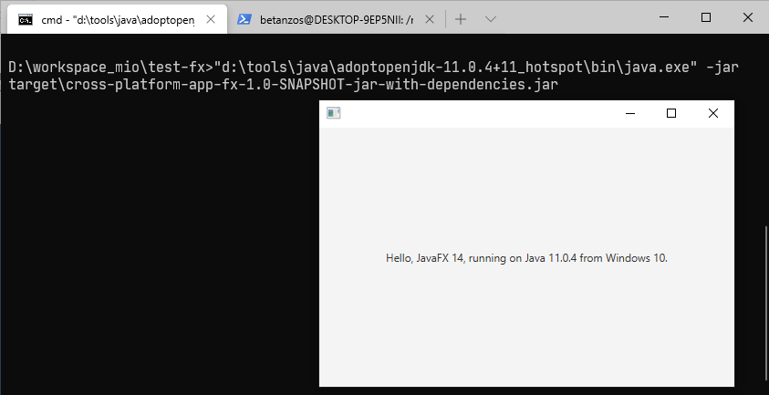
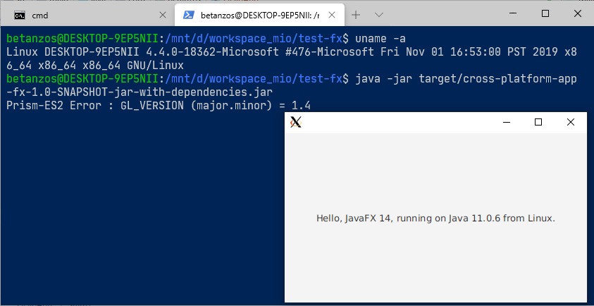

# Cross-Platform JavaFX App skeleton
This is a skeleton maven project for show how we need to configure the project in order to can to build
a executable fat JAR of our JavaFX application.

# Important notes
1 - In order to include all platform-specific libs (dll, so end dylib) into the generated project JAR
is needed add manually all JavaFX maven dependencies.
```xml
<dependency>
    <groupId>org.openjfx</groupId>
    <artifactId>javafx-graphics</artifactId>
    <version>${javafx.version}</version>
    <classifier>win</classifier>
</dependency>
<dependency>
    <groupId>org.openjfx</groupId>
    <artifactId>javafx-graphics</artifactId>
    <version>${javafx.version}</version>
    <classifier>linux</classifier>
</dependency>
<dependency>
    <groupId>org.openjfx</groupId>
    <artifactId>javafx-graphics</artifactId>
    <version>${javafx.version}</version>
    <classifier>mac</classifier>
</dependency>
```

Optionally you can exclude all it's transitive dependencies. I like this way although it is more verbose.
```xml
<dependency>
    <groupId>org.openjfx</groupId>
    <artifactId>javafx-graphics</artifactId>
    <version>${javafx.version}</version>
    <classifier>mac</classifier>
    <exclusions>
        <exclusion>
            <groupId>*</groupId>
            <artifactId>*</artifactId>
        </exclusion>
    </exclusions>
</dependency>
```

2 - Because of JDK (almost) always tries to start JavaFX apps using the `MODULE_PATH` instead the `CLASS_PATH`
we need to add a class that doesn't inherit from `javafx.application.Application` in order to start the app.

This app can only be run using `CLASS_PATH`, otherwise it could not be multi-platform due to the module names
overlap caused by the use of more than one dependency which define the same module (i.e. `javafx-graphics-win.jar`
and `javafx-graphics-mac.jar` define module `javafx.graphics`).

```java
public class Main {
    public static void main(String[] args) {
        HelloApp.runApp(args);
    }
}
```
```java
public class HelloApp extends Application {

    @Override
    public void start(Stage stage) {
        // here the code
    }

    public static void runApp(String[] args) {
        launch(args);
    }
}
```

More about this topic [here](http://mail.openjdk.java.net/pipermail/openjfx-dev/2018-June/021977.html).

# Usage
You can generate the project executable JAR form any OS
```
$ mvn clean package
```


and then run it on each without requires any change
```
$ java -jar target/cross-platform-app-fx-1.0-SNAPSHOT-jar-with-dependencies.jar 
```

**Running on Windows**


**Running on Linux (from WSL)**


# License
This project is Open Source software released under the [Apache 2.0 license](https://www.apache.org/licenses/LICENSE-2.0.html).